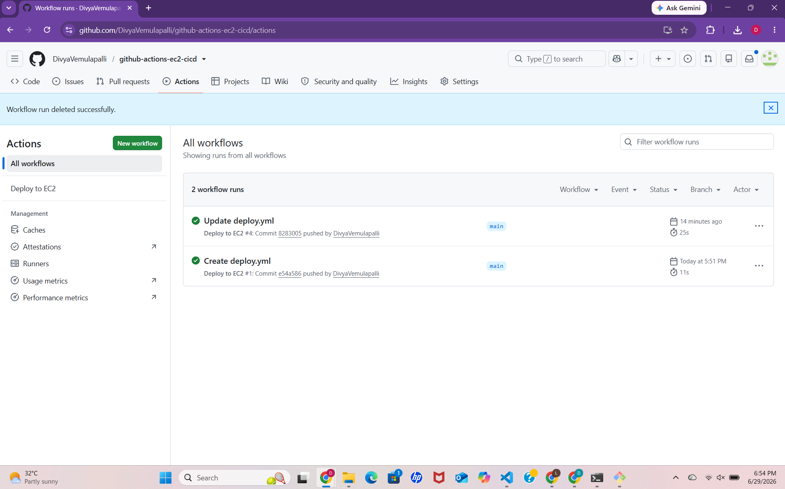
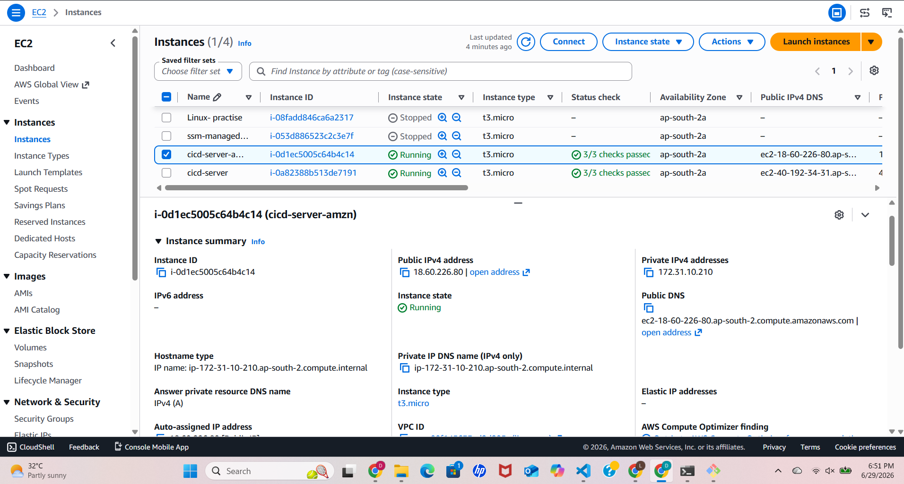
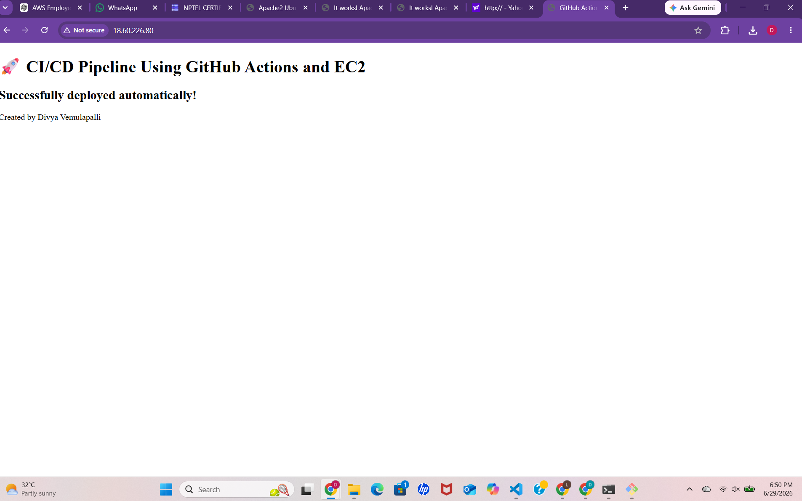
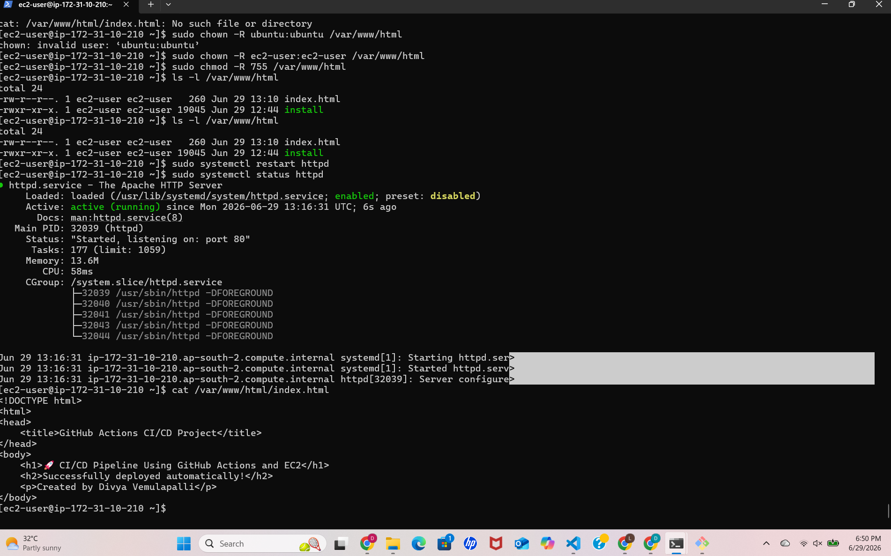

# github-actions-ec2-cicd
# 🚀 CI/CD Pipeline Using GitHub Actions and AWS EC2

## 📌 Project Overview
This project demonstrates a complete CI/CD pipeline using **GitHub Actions** to automatically deploy a simple static website to an **AWS EC2 instance** running Apache server.

Every push to the `main` branch triggers an automated deployment workflow that copies files to the EC2 server and updates the website.

---

## 🏗️ Architecture

GitHub Repository  
⬇️  
GitHub Actions (CI/CD Pipeline)  
⬇️  
Secure SSH Connection  
⬇️  
AWS EC2 Instance (Apache Web Server)  
⬇️  
Live Website

---

## ⚙️ Tech Stack

- AWS EC2 (Ubuntu / Amazon Linux)
- Apache HTTP Server
- GitHub Actions
- SSH (Secure Shell)
- SCP (Secure Copy Protocol)
- Git & GitHub
- HTML

---

## 🚀 Features

- Automated deployment on every push
- Secure file transfer using SSH keys
- Hosting static website on EC2
- CI/CD pipeline using GitHub Actions
- Zero manual deployment process

---

---

## 📸 screenshots

### 🔹 GitHub Actions Success

### 🔹 EC2 Instance Running

### 🔹 Live Website Output

### 🔹 Apache Service Running on EC2

---

## 🔧 Setup Process

### 1. Launch EC2 Instance
- Create EC2 instance
- Install Apache (`sudo yum install httpd` or `sudo apt install apache2`)
- Start server

### 2. Configure GitHub Secrets
Add the following secrets in GitHub repo:
- `EC2_HOST`
- `EC2_USERNAME`
- `EC2_SSH_KEY`

### 3. GitHub Actions Workflow
- Automatically triggers on push to `main`
- Uses `appleboy/scp-action` to deploy files

---

## 🌐 Result

After successful deployment:
👉 Website is accessible via EC2 public IP  
👉 Changes are automatically deployed via GitHub Actions  

---

##  Author

**Divya Vemulapalli**

